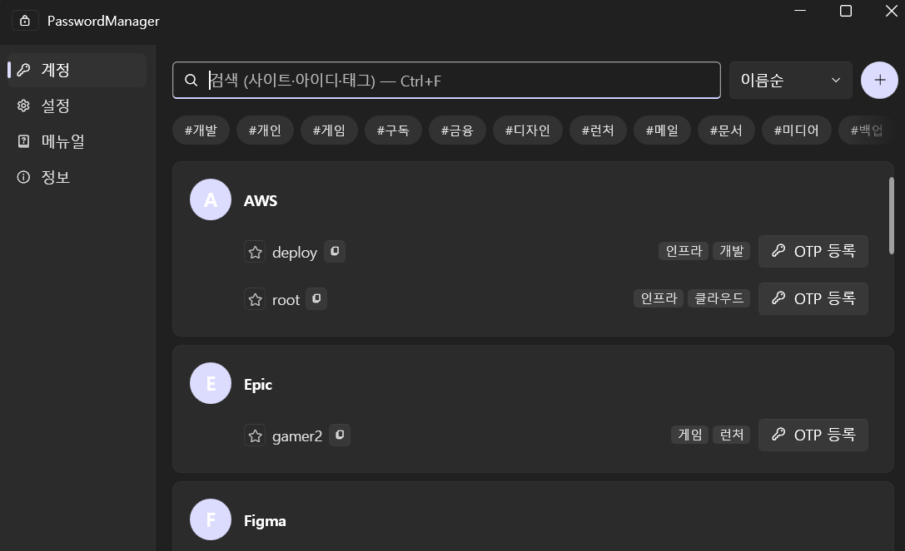
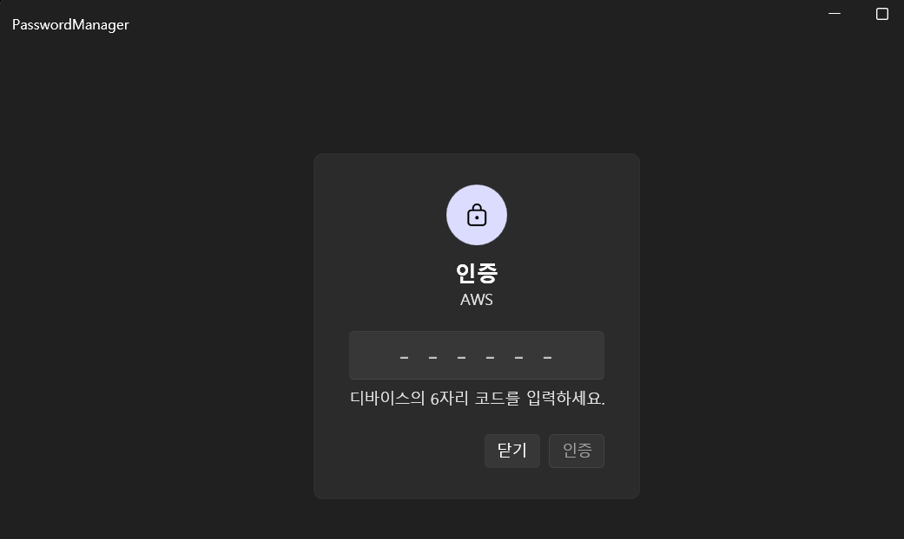
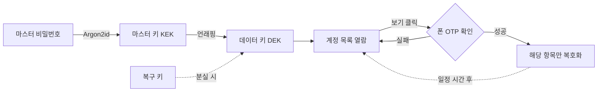
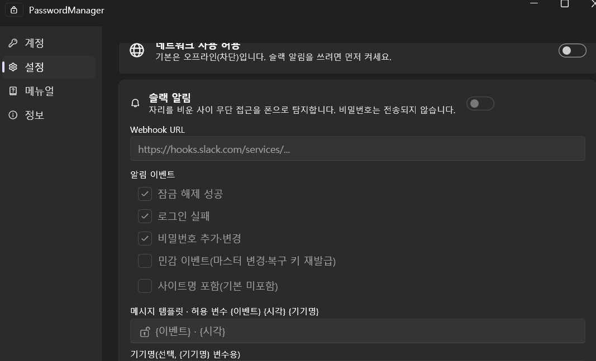

# PasswordManager

> 내 PC에서만 동작하는 **로컬 전용** 비밀번호 관리자 — Windows · .NET 8 · WPF

여러 사이트와 게임의 아이디·비밀번호를 한곳에 모아 두면 편하긴 한데, 그걸 남의 서버에 맡기자니 영 찜찜하죠.

이 앱은 모든 데이터를 이 PC의 **암호화된 파일 하나**에만 담아 두고, 어디로도 내보내지 않습니다. 게다가 비밀번호를 바꿀 때마다 **이전 값과 마지막 변경일**을 알아서 기록해 둬서, "예전 비번이 뭐였더라" 하는 순간에도 당황할 일이 없습니다.



사이드바에서 **계정 · 설정 · 메뉴얼 · 정보**로 이동하고, 상단에서 검색·정렬·추가를 합니다. 계정은 사이트별로 묶여 여러 아이디를 함께 보여 주며, 각 항목에는 즐겨찾기 별과 태그, 복사·OTP 버튼이 붙습니다.

---

## 무엇을 할 수 있나요

- **계정 관리** — 사이트별로 아이디·비밀번호·메모·태그를 저장하고, 한 사이트에 여러 계정도 등록할 수 있어요.
- **강한 암호화** — 마스터 비밀번호 하나로 볼트 전체를 잠급니다 (Argon2id + AES-256-GCM).
- **2단계 열람 보호** — 개별 비밀번호를 볼 때 폰의 OTP를 한 번 더 확인합니다.
- **비밀번호 이력** — 바꿀 때마다 이전 값과 날짜를 자동으로 남겨 둡니다.
- **비밀번호 생성기** — 길이와 문자 종류를 골라 안전한 비밀번호를 즉석에서 만듭니다.
- **빠른 검색·태그 필터** — 제목·아이디·태그로 원하는 계정을 바로 찾습니다.
- **즐겨찾기·정렬** — 자주 쓰는 계정을 위에 고정하고, 이름·최근 변경·최근 사용순으로 정렬합니다.
- **휴지통** — 지운 계정을 30일간 보관해, 실수로 삭제해도 되살릴 수 있어요.
- **복구 키** — 마스터 비밀번호를 잊어도 최초에 발급한 복구 키로 되살립니다.
- **슬랙 알림(선택)** — 자리를 비운 사이의 접근을 폰으로 감지합니다. 기본은 완전 오프라인.
- **위생 관리** — 클립보드 자동 삭제, 자동 잠금, 화면 마스킹, `Ctrl+F`·`Ctrl+N`·`Ctrl+L` 같은 단축키.

이 중에서도 **비밀번호 이력**이 이 앱의 성격을 잘 보여 줍니다. 비밀번호를 새로 저장하면 예전 값이 사라지지 않고 변경 날짜와 함께 항목 안에 쌓여, "바꾸긴 했는데 어디서는 아직 옛날 걸 쓰던데" 같은 상황에서 지난 값을 되짚어 볼 수 있습니다.

---

## 어떻게 안전한가요

이 앱의 보안은 세 가지 원칙 위에 서 있습니다.

1. **마스터 비밀번호 하나로 전부 잠급니다.** 이 비밀번호가 없으면 계정 목록조차 열리지 않습니다.
2. **평소엔 잠가 두고, 볼 때만 풉니다.** 개별 비밀번호는 "보기"를 누른 그 순간에만 복호화됩니다 (지연 복호화).
3. **볼 때 한 번 더 확인합니다.** 그 순간에도 폰 OTP를 요구해, 잠깐 자리를 비운 사이 훔쳐보는 것을 막습니다.



전체 흐름을 그림으로 보면 이렇습니다. 마스터 비밀번호로 볼트를 열어 목록을 보고, 개별 비밀번호는 OTP를 통과한 순간에만 잠깐 풀립니다.



키는 두 개로 나뉩니다. 볼트를 여는 **마스터 키(KEK)** 와 데이터를 실제로 암호화하는 **데이터 키(DEK)** 가 따로 있죠.

이렇게 나눈 덕분에 마스터 비밀번호를 바꿔도 본문을 통째로 다시 암호화하지 않고 DEK를 감싼 부분만 갱신하면 됩니다. 또 로그인할 때 암호화 강도(KDF)가 권장치보다 낮으면 조용히 더 강하게 올려 둡니다.

> ⚠️ 로컬 전용이라 **마스터 비밀번호와 복구 키를 둘 다 잃으면 되살릴 방법이 없습니다.**
> 복구 키는 종이 등 앱 밖 안전한 곳에 꼭 보관하세요.

---

## 알림은 켤 때만, 그것도 최소한만 (선택)

집이나 회사에서 잠깐 자리를 비운 사이 누가 내 PC를 건드리지 않았는지 폰으로 알고 싶을 때가 있죠. 이 앱은 그런 경우를 위한 **슬랙 알림**을 제공하되, 기본값은 **완전 오프라인**입니다.



- **전역 오프라인 스위치가 최상위 잠금장치**입니다. 이걸 켜기 전에는 어떤 데이터도 밖으로 나가지 않습니다.
- 알림을 켜면 **잠금 해제 성공 · 로그인 실패 · 비밀번호 추가·변경** 같은 이벤트를 슬랙으로 보냅니다. 마스터 변경 같은 민감 이벤트나 사이트명 포함은 별도로 선택해야 합니다.
- 문구는 `{이벤트}` `{시각}` `{기기명}` 같은 **허용된 변수만** 끼워 넣는 템플릿으로 만들어지고, **비밀번호는 절대 전송되지 않습니다.**
- 알림 전송은 앱 동작과 완전히 분리되어(비동기·베스트에포트), 전송이 실패하거나 느려도 잠금 해제·저장은 즉시 진행됩니다.

---

## 설치하고 쓰기

### 1. 실행 파일 만들기

.NET 런타임까지 담은 **단일 exe**로 게시합니다. 받는 PC에 .NET을 따로 설치할 필요가 없습니다.

```powershell
dotnet publish src/PasswordManager.App -c Release -r win-x64 --self-contained true `
  -p:PublishSingleFile=true -p:EnableCompressionInSingleFile=true `
  -p:IncludeNativeLibrariesForSelfExtract=true -p:DebugType=none -o publish
```

`publish/PasswordManager.exe`(약 71MB) 하나가 나옵니다. 원하는 폴더에 옮기고 바로가기를 만들어 시작 메뉴나 작업표시줄에 고정하면 끝입니다.

### 2. 첫 실행

처음 켜면 짧은 설정 마법사가 안내합니다.

1. **마스터 비밀번호 설정** — 12자 이상, 흔한 비밀번호는 막힙니다. 이 하나로 볼트 전체가 잠깁니다.
2. **복구 키 발급** — 화면에 뜬 복구 키를 **앱 밖에** 보관하고 확인에 체크합니다.
3. **OTP 등록** — 표시된 QR을 폰의 Google Authenticator 등으로 스캔합니다. 등록해야 비밀번호 보기·편집·삭제가 열립니다.

볼트 파일은 `%APPDATA%\PasswordManager\vault.dat`에 만들어지고, 저장할 때마다 직전 파일이 `vault.dat.bak`으로 보존됩니다. 저장은 임시 파일에 먼저 쓰고 교체하는 **원자적 쓰기**라, 저장 도중 앱이 꺼져도 기존 파일이 깨지지 않습니다.

> ⚠️ **백업**: 볼트 파일을 잃으면 계정 정보도 함께 사라집니다.
> `설정 > 백업·데이터`에서 주기적으로 백업해 두세요.

### 3. 마스터 비밀번호를 잊었다면

잠금 화면의 **"비밀번호를 잊으셨나요?"** 에서 최초에 발급한 복구 키를 넣으면 새 마스터 비밀번호를 설정할 수 있습니다. 서버도 이메일도 거치지 않고 이 PC 안에서 끝납니다.

---

## 기술 스택

| 구분 | 사용 |
|---|---|
| 플랫폼 | Windows 10/11 데스크톱 |
| 언어·런타임 | C# / .NET 8 (LTS) |
| UI | WPF + MVVM (CommunityToolkit.Mvvm) |
| 암호화 | Argon2id (Konscious) · AES-256-GCM (.NET 내장) |
| OTP | TOTP (RFC 6238) |

프로젝트 구조는 이렇게 나뉩니다.

```
PasswordManager/
├─ src/
│  ├─ PasswordManager.App/         # WPF 화면 (Views, App.xaml)
│  ├─ PasswordManager.ViewModels/  # 화면 로직 (MVVM)
│  ├─ PasswordManager.Core/        # 암호화·OTP 등 순수 로직
│  └─ PasswordManager.Storage/     # 볼트 파일 읽기/쓰기
├─ tests/                          # 단위 테스트
└─ docs/                           # 설계·의사결정 문서
```

---

## 개발

```powershell
dotnet build                                  # 빌드
dotnet test                                   # 전체 테스트
dotnet run --project src/PasswordManager.App  # 실제 볼트로 실행
```

더미 데이터가 든 **임시 볼트**로 화면만 확인하려면:

```powershell
$env:PWM_VAULT_PATH = "$env:TEMP\pwm-seed\vault.dat"   # 실제 볼트와 분리
$env:PWM_SEED = "1"                                     # 볼트가 없을 때만 시드
dotnet run --project src/PasswordManager.App
```

시드 볼트의 마스터 비밀번호는 `DevSeed.cs`에 있습니다.

개발은 **테스트 우선(TDD)** 으로 진행하며, 암호화·TOTP·이력 계산 같은 핵심 로직은 반드시 단위 테스트로 검증합니다.

---

## 더 읽을거리

자세한 설계와 결정 배경은 `docs/` 폴더에 있습니다.

- [`docs/design.md`](docs/design.md) — 전체 설계·아키텍처
- [`docs/tradeoffs.md`](docs/tradeoffs.md) — 선택·트레이드오프 기록 (TD-001 …)
- [`docs/flows.md`](docs/flows.md) — 주요 화면 흐름 (잠금 해제, 열람, 이력, 복구, 알림)
- [`docs/ui.md`](docs/ui.md) · [`docs/design-ux.md`](docs/design-ux.md) — UI/UX 설계
