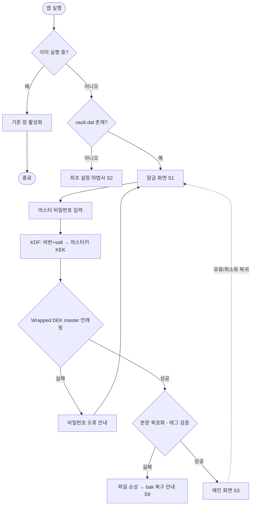
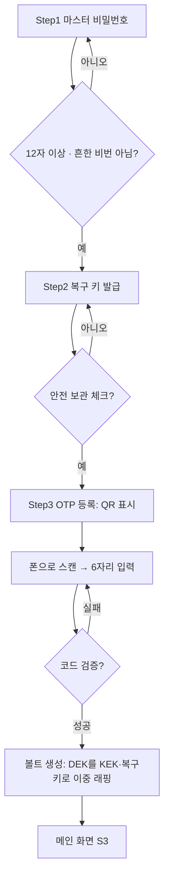
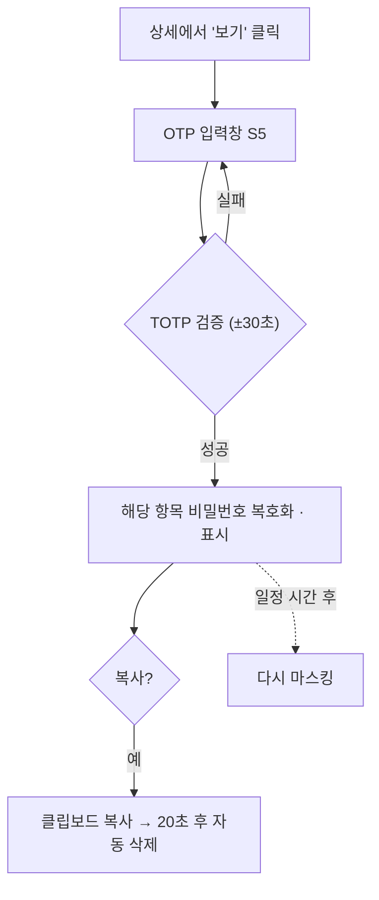
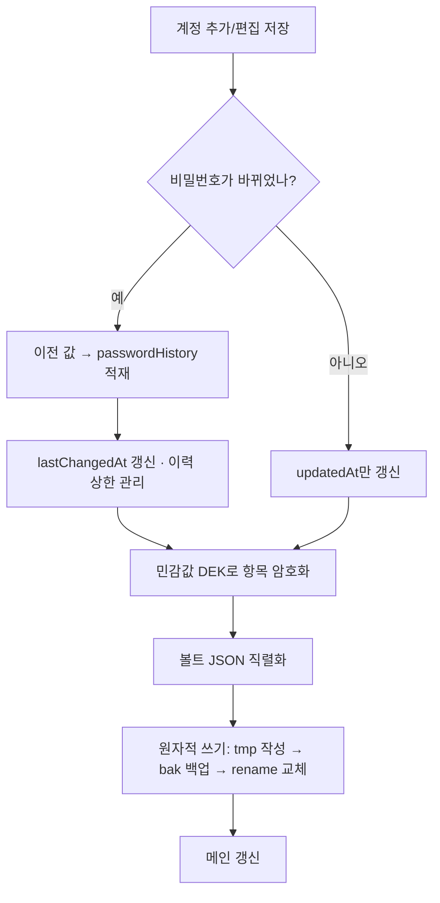
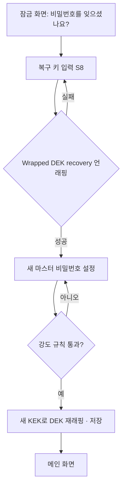
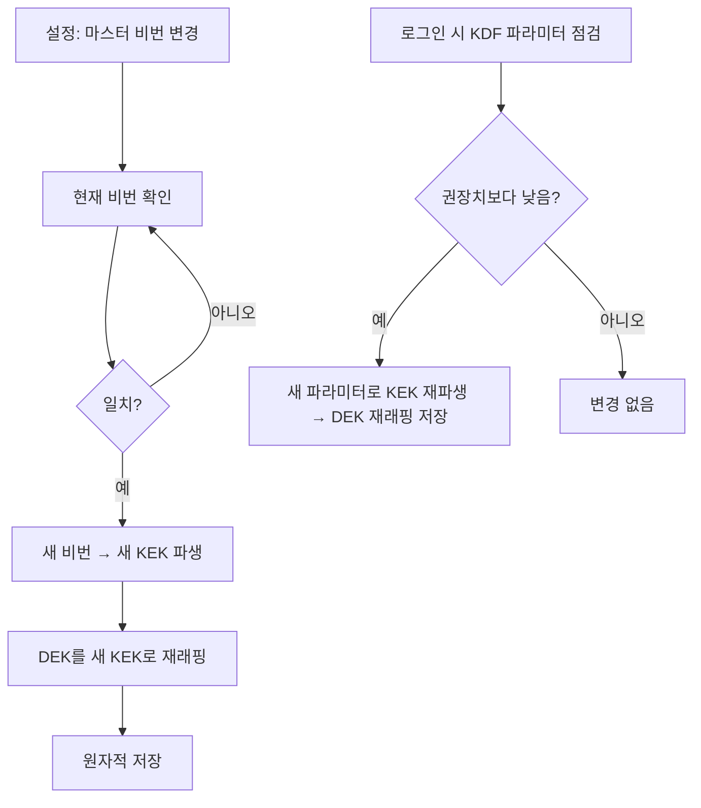
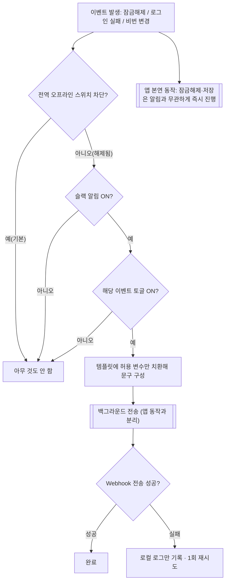

# 기능 흐름도 (Flows)

> 주요 기능의 동작 흐름을 mermaid로 도식화한다.
> 설계 근거는 [`design.md`](./design.md), 화면은 [`ui.md`](./ui.md), 결정 로그는 [`tradeoffs.md`](./tradeoffs.md).

---

## 1. 앱 실행 → 잠금 해제

- 단일 인스턴스(Mutex)로 이중 실행 차단(TD-007).
- 실패 원인 구분: DEK 언래핑 실패=비번 오류 / 본문 태그 실패=파일 손상(design 5.3).

---

## 2. 최초 설정 마법사 (S2)

- 강도 규칙: 길이 중심(최소 12자) + 흔한 비번 차단(TD-009).
- 복구 키 무조건 발급 + 보관 확인 체크(TD-010).

---

## 3. 비밀번호 열람 (OTP 게이트 + 지연 복호화)

- OTP는 암호학적 잠금이 아닌 열람 재확인 게이트(TD-004).
- 평소엔 잠가 두고 통과 순간에만 복호화(지연 복호화, design 5.5).

---

## 4. 계정 추가 / 편집 저장

- 비밀번호 변경 시에만 이력 적재(design 7.2).
- 원자적 쓰기로 저장 중 크래시에도 기존 파일 보존(TD-001, design 5.3).

---

## 5. 마스터 비밀번호 복구 (복구 키)

- 복구 키로 DEK를 풀어 새 비번 설정. 서버·이메일 불필요(TD-010).
- 마스터 비번과 복구 키를 둘 다 잃으면 복구 불가.

---

## 6. 마스터 비밀번호 변경(rekey) · KDF 자동 상향

- 데이터 본문은 재암호화하지 않고 DEK 재래핑만(2단 키, TD-006).
- 마스터 키/복구 키가 각각 DEK를 감싸므로, 비번 변경 시 마스터 쪽 래핑만 갱신.

---

## 7. 슬랙 알림 (옵트인 · 비동기 · 베스트에포트)

- **전역 오프라인 스위치**가 최상위 게이트 — 차단(기본)이면 어떤 아웃바운드도 없음(TD-013).
- 알림은 **앱 동작을 절대 막지 않는다**(비동기·베스트에포트, TD-012).
- 문구는 **허용 변수 템플릿**으로 구성(secret 변수 미제공, TD-014). 사이트명은 기본 미포함.
